# BitVM2 Node

The main node implementation for GOAT Network's BitVM2 bridge protocol. This module handles P2P networking, message processing, scheduled tasks, and RPC services for secure cross-chain asset transfers between Bitcoin and GOAT L2.

## Table of Contents

- [Overview](#overview)
- [Architecture](#architecture)
- [Actor System](#actor-system)
- [Core Workflows](#core-workflows)
  - [Peg-in (Bridge-In)](#peg-in-bridge-in)
  - [Peg-out (Bridge-Out)](#peg-out-bridge-out)
  - [Challenge Process](#challenge-process)
- [Graph State Machine](#graph-state-machine)
- [Graph Storage & Synchronization](#graph-storage--synchronization)
- [Message System](#message-system)
- [Scheduled Tasks](#scheduled-tasks)
- [Module Structure](#module-structure)
- [Build & Run](#build--run)
- [Configuration](#configuration)
- [RPC API](#rpc-api)

---

## Overview

The BitVM2 Node (`bitvm2-noded`) is a multi-role distributed node that participates in the BitVM2 cross-chain bridge protocol. It enables trustless Bitcoin-to-L2 transfers through a combination of:

- **Multi-signature Consensus**: Committee-based transaction presigning
- **Optimistic Verification**: Watchtower monitoring with dispute resolution
- **ZK Proofs**: Cryptographic verification of state transitions
- **P2P Graph Distribution**: Decentralized graph data synchronization via relayer nodes

### Key Capabilities

| Capability | Description |
|------------|-------------|
| **P2P Communication** | libp2p-based gossip network (Kademlia DHT + Gossipsub) |
| **Chain Monitoring** | Bitcoin and GOAT L2 event watching |
| **Graph Management** | Transaction graph creation, signing, and lifecycle tracking |
| **Graph Synchronization** | P2P-based graph distribution with relayer node support |
| **Challenge Processing** | Watchtower challenges and dispute resolution |
| **Proof Coordination** | ZK proof generation via proof-builder-rpc |

---

## Architecture

### Fig-01-1-System-Architecture

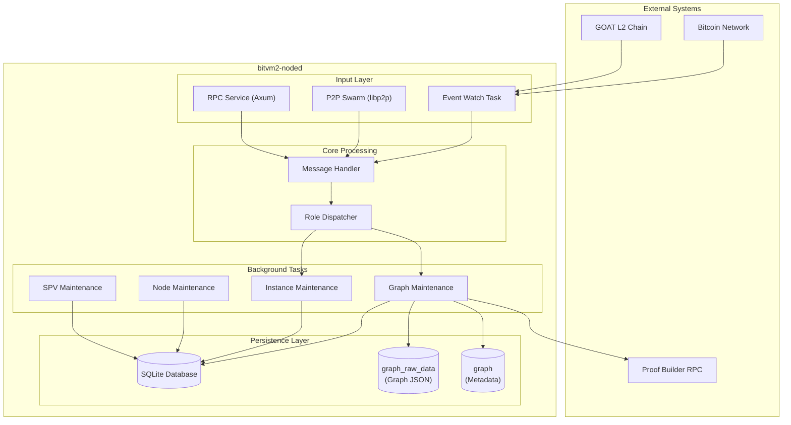

**Description**: The system employs a three-layer architecture. The Input Layer receives events from external chains, P2P network messages, and RPC requests. The Core Processing Layer dispatches messages to role-specific handlers. The Background Tasks Layer manages graph state machines, instance lifecycles, node health, and SPV header chain updates. All state is persisted to SQLite database, with graph data stored in a dedicated `graph_raw_data` table.

### Fig-01-2-Component-Interaction

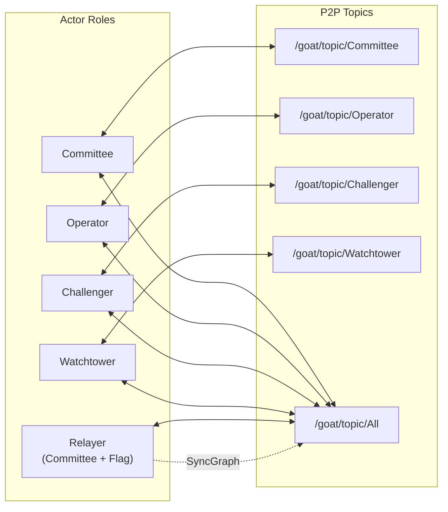

**Description**: Each role subscribes to its corresponding gossipsub topic for message exchange. All roles subscribe to the `/All` topic for broadcast messages. Relayer nodes (Committee members with `ENABLE_RELAYER=true`) respond to graph synchronization requests and distribute graph data across the network.

---

## Actor System

BitVM2 employs four primary actor roles plus an optional relayer capability:

### Fig-02-1-Actor-Roles

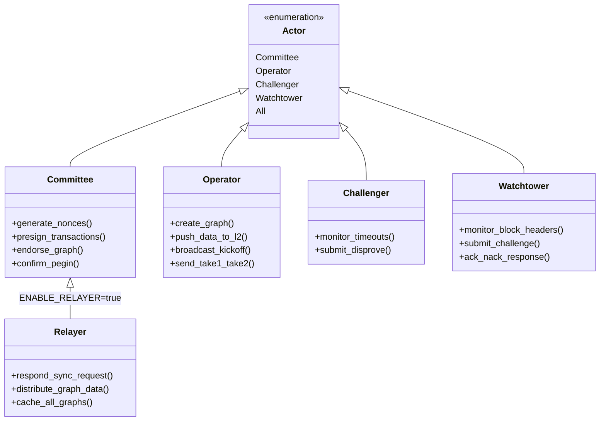

**Description**: The class diagram shows the inheritance relationship between the Actor enumeration and role implementations. Relayer is a special mode of Committee nodes enabled via environment variable.

### Role Responsibilities

| Role | Responsibilities | Key Messages |
|------|------------------|--------------|
| **Committee** | Multi-sig committee member, responsible for presigning and graph endorsement | `NonceGeneration`, `CommitteePresign`, `EndorseGraph` |
| **Operator** | Bridge operator, creates graphs and executes withdrawal transactions | `CreateGraph`, `KickoffSent`, `Take1Sent`, `Take2Sent` |
| **Challenger** | Dispute challenger, monitors timeouts and submits disproofs | `DisproveReady`, `DisproveSent` |
| **Watchtower** | Chain monitor, validates block headers and submits challenges | `WatchtowerChallengeSent` |
| **Relayer** | Graph data distributor, responds to sync requests | `SyncGraphRequest`, `SyncGraph` |

---

## Core Workflows

### Peg-in (Bridge-In)

Users deposit BTC into the bridge contract and receive equivalent assets on GOAT L2.

#### Fig-03-1-Pegin-Sequence

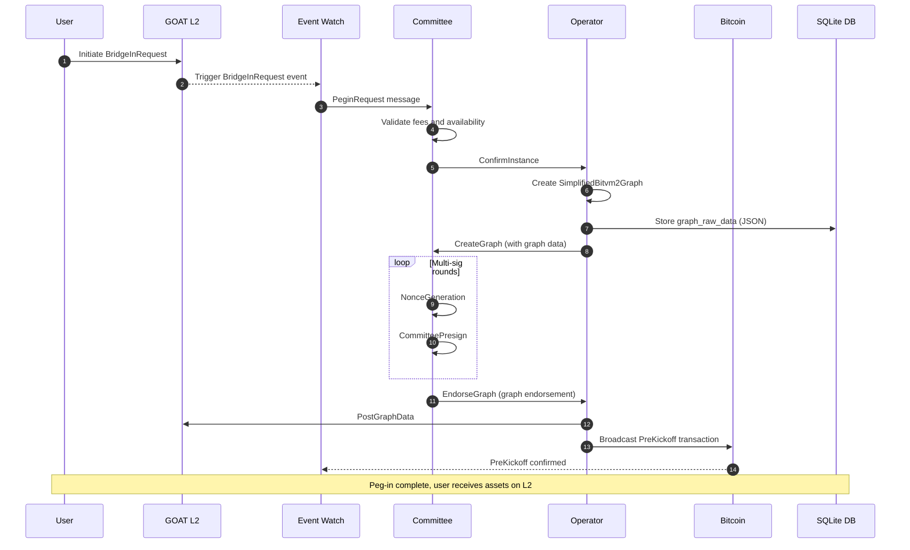

**Description**: The Peg-in flow consists of three phases: (1) Request Phase - user initiates request on L2, committee validates; (2) Graph Construction Phase - Operator creates transaction graph (stored locally in SQLite), committee performs MuSig2 multi-signing; (3) Confirmation Phase - data posted to L2, PreKickoff transaction confirms to complete the process.

#### Fig-03-2-Instance-BridgeIn-Status

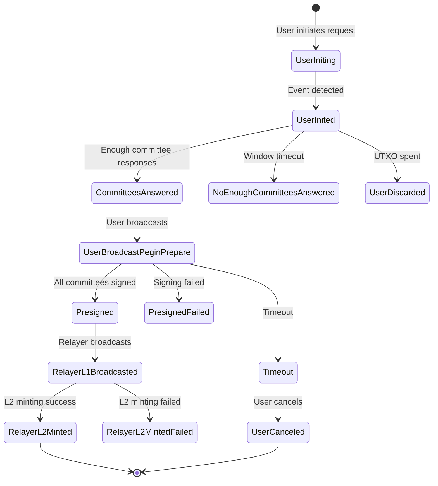

**Description**: This state diagram shows the complete lifecycle of a bridge-in instance, from initial request through committee validation, signing, and final minting on L2.

### Peg-out (Bridge-Out)

Users initiate withdrawal on GOAT L2 and receive BTC on Bitcoin. Two paths exist:

#### Fig-03-3-Pegout-Happy-Path

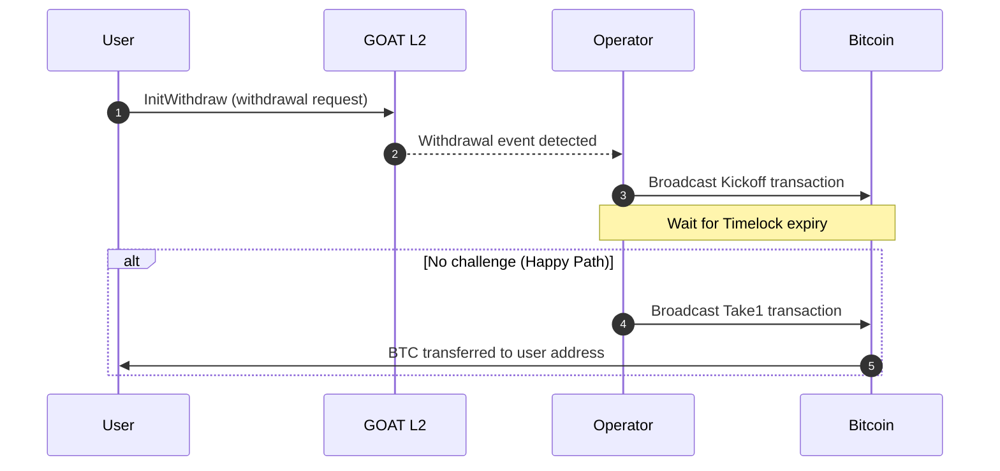

**Description**: The Happy Path is the simplest route - when no Watchtower challenges the Operator's claim, the Operator completes the withdrawal via Take1 transaction after the Timelock expires.

#### Fig-03-4-Pegout-Challenge-Path

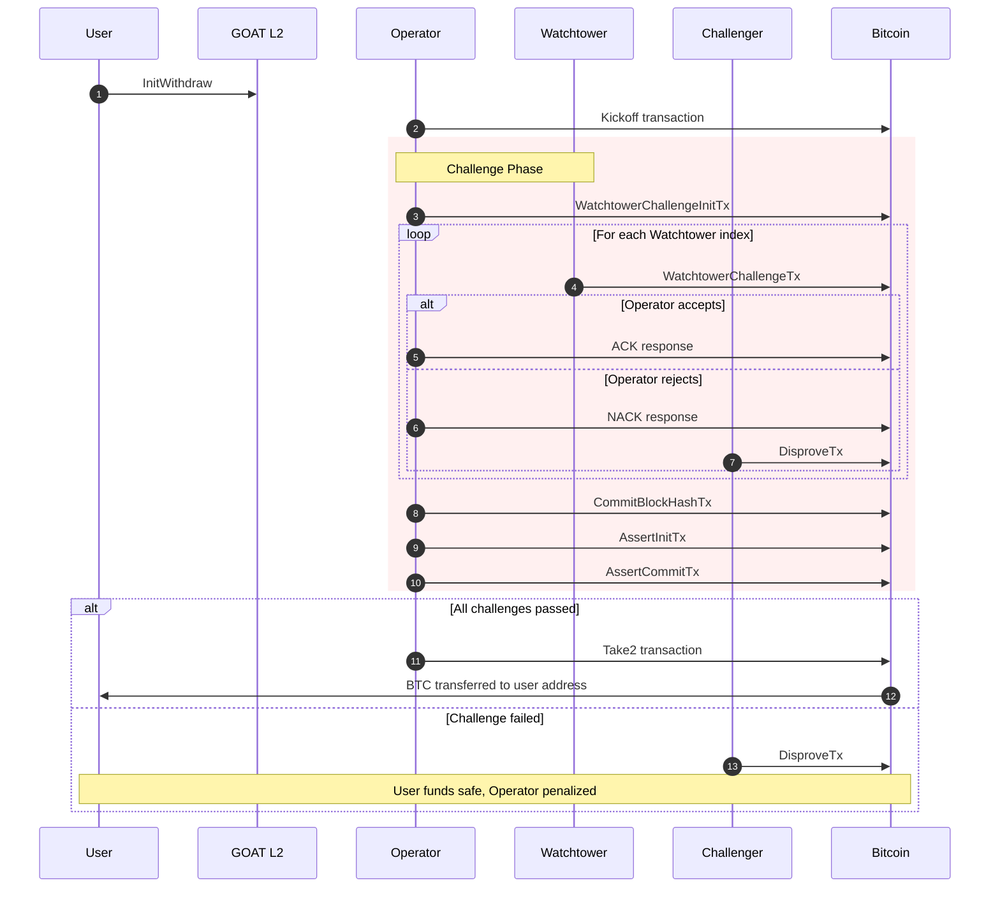

**Description**: The Challenge Path is triggered when Watchtowers detect anomalies. It contains three sub-phases: (1) Watchtower Challenge - watchers submit challenges; (2) BlockHash Commit - Operator commits block hash; (3) Assert Commit - Operator commits assertion proofs. Failure in any phase triggers Disprove.

### Challenge Process

#### Fig-03-5-Challenge-Substatus

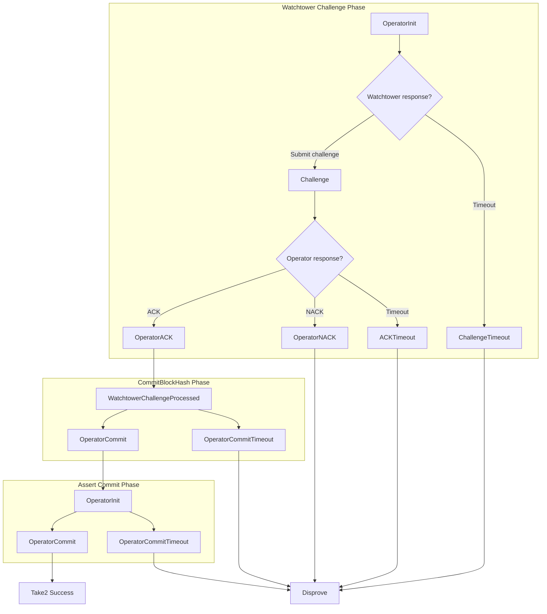

**Description**: The challenge process tracks three parallel state machines. Any timeout or failure in sub-phases triggers the Disprove path, ensuring system security.

---

## Graph State Machine

Graph is the core data structure in BitVM2, representing a set of presigned Bitcoin transactions.

### Fig-04-1-Graph-Lifecycle

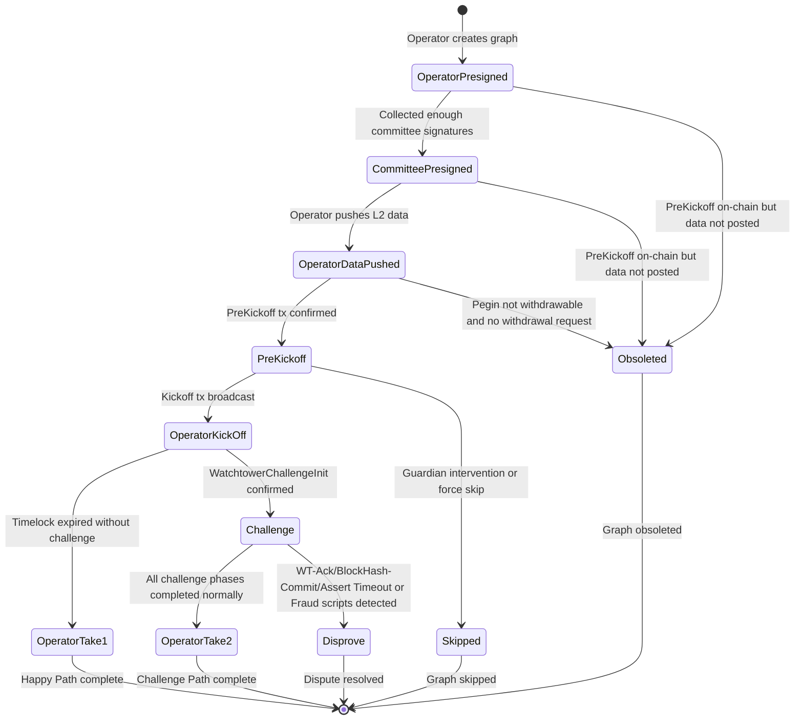

**Description**: Graph goes through 9 main states. The normal flow starts from `OperatorPresigned`, proceeds through signature collection, data publishing, and Kickoff, finally completing via Take1 (Happy Path) or Take2 (Challenge Path). Abnormal cases enter `Obsoleted`, `Skipped`, or `Disprove` terminal states.

### Fig-04-2-Graph-Status-Transitions

| Source State | Target State | Trigger Condition |
|--------------|--------------|-------------------|
| `OperatorPresigned` | `CommitteePresigned` | Received enough committee presignatures |
| `OperatorPresigned` | `Obsoleted` | PreKickoff on-chain but graph data not posted |
| `CommitteePresigned` | `OperatorDataPushed` | Operator successfully pushed data to L2 |
| `OperatorDataPushed` | `PreKickoff` | PreKickoff tx confirmed on Bitcoin |
| `OperatorDataPushed` | `Obsoleted` | Pegin not withdrawable and no withdrawal request |
| `PreKickoff` | `OperatorKickOff` | Kickoff tx broadcast successfully |
| `PreKickoff` | `Skipped` | Guardian intervention or force skip |
| `OperatorKickOff` | `OperatorTake1` | Timelock expired without challenge |
| `OperatorKickOff` | `Challenge` | WatchtowerChallengeInit tx confirmed |
| `Challenge` | `OperatorTake2` | All sub-phases completed normally |
| `Challenge` | `Disprove` | Timeout or challenge failure detected |

### Fig-04-3-Challenge-SubStatus-ER

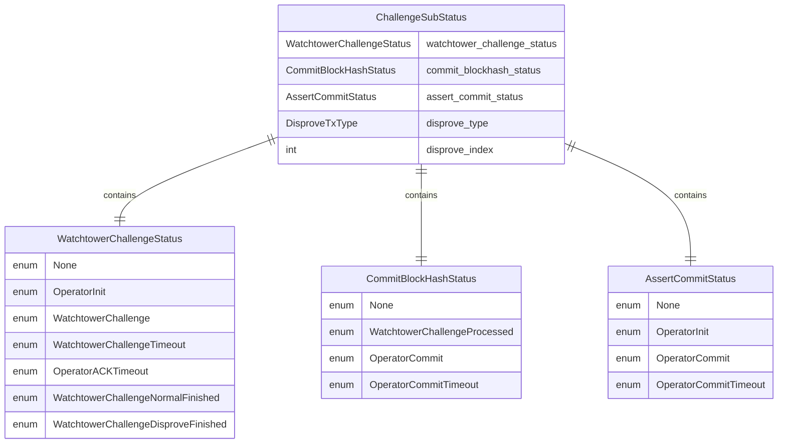

**Description**: `ChallengeSubStatus` aggregates three parallel status trackers. Only when `watchtower_challenge_status == NormalFinished`, `commit_blockhash_status == OperatorCommit`, and `assert_commit_status == OperatorCommit` can the system transition to `OperatorTake2` state.

---

## Graph Storage & Synchronization

Graph data is stored locally in SQLite and distributed via P2P messaging.

### Fig-05-1-Graph-Storage-Architecture

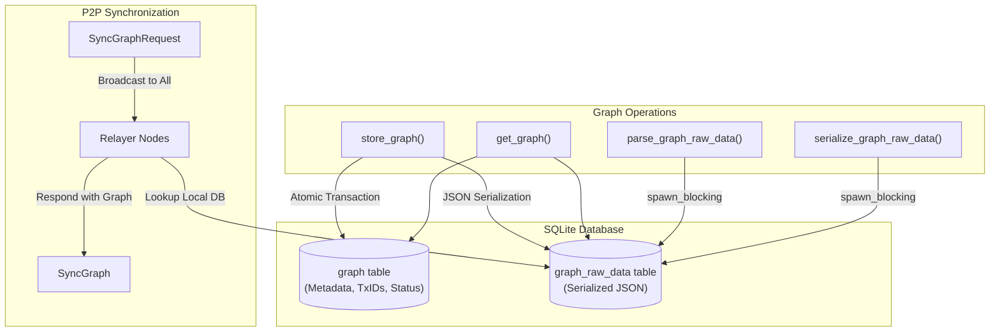

**Description**: Graph storage uses a two-table approach: `graph` for metadata/transaction IDs and `graph_raw_data` for full serialized graph JSON. Large graph serialization uses `spawn_blocking` to prevent async runtime blocking. P2P synchronization enables nodes to request missing graphs from relayer nodes.

### Fig-05-2-Graph-Sync-Sequence

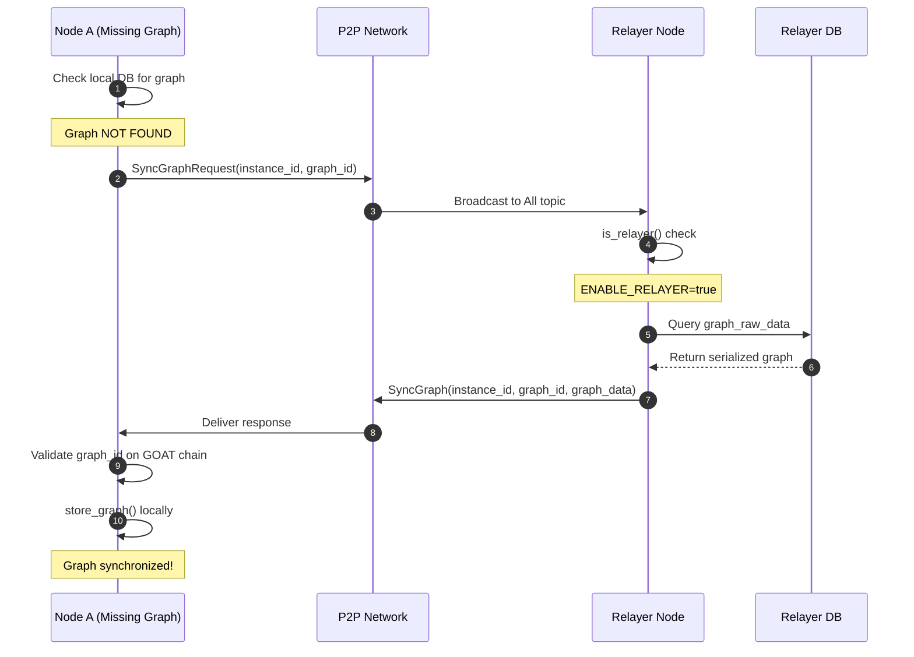

**Description**: When a node lacks required graph data, it broadcasts a `SyncGraphRequest`. Relayer nodes (Committee members with `ENABLE_RELAYER=true`) respond with the full graph data via `SyncGraph` message. The requesting node validates and stores the graph locally.

### Graph Data Tables

#### graph table (Metadata)

| Column | Type | Description |
|--------|------|-------------|
| `graph_id` | UUID | Primary key |
| `instance_id` | UUID | Associated bridge instance |
| `status` | String | Current GraphStatus |
| `sub_status` | String | Challenge sub-status JSON |
| `operator_pubkey` | String | Operator's public key |
| `*_txid` | Txid | Transaction IDs for all graph transactions |
| `created_at`, `updated_at` | i64 | Timestamps |

#### graph_raw_data table (Full Graph)

| Column | Type | Description |
|--------|------|-------------|
| `graph_id` | UUID | Primary key (FK to graph) |
| `raw_data` | TEXT | JSON-serialized SimplifiedBitvm2Graph |
| `created_at`, `updated_at` | i64 | Timestamps |

---

## Message System

### Fig-06-1-Message-Structure

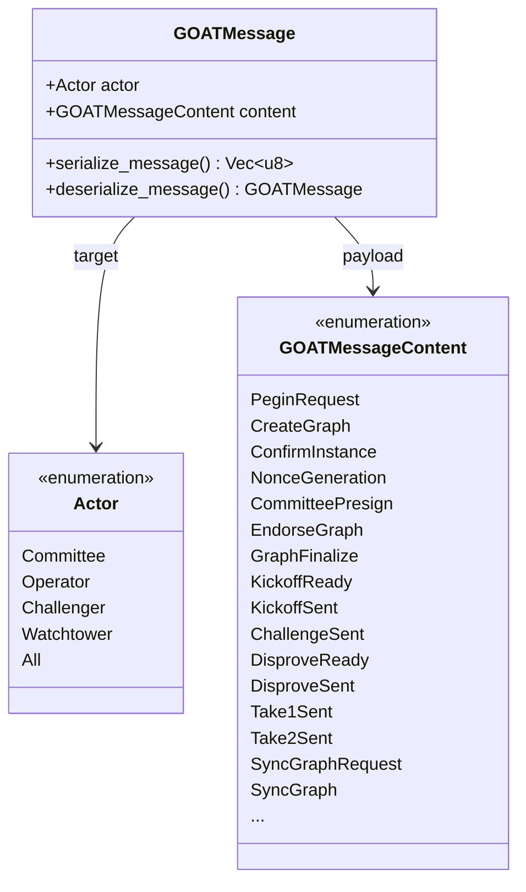

**Description**: The message system uses role-based addressing. Each message specifies a target role and content type, broadcast via Gossipsub to the corresponding topic. Messages are serialized using `serde_json` with `spawn_blocking` for large payloads.

### Message Categories

#### Peg-in Messages

| Message | Sender | Receiver | Description |
|---------|--------|----------|-------------|
| `PeginRequest` | EventWatch | Committee | Peg-in request notification |
| `ConfirmInstance` | Committee | Operator | Instance creation confirmation |
| `CreateGraph` | Operator | Committee | Graph creation request (includes full graph) |
| `NonceGeneration` | Committee | Committee/Operator | MuSig2 nonce broadcast |
| `CommitteePresign` | Committee | Committee/Operator | Presignature broadcast |
| `EndorseGraph` | Committee | Operator | Graph endorsement |
| `GraphFinalize` | Operator | All | Graph completion notification |

#### Peg-out Messages

| Message | Sender | Receiver | Description |
|---------|--------|----------|-------------|
| `KickoffReady` | System | Operator | Kickoff ready notification |
| `KickoffSent` | Operator | All | Kickoff transaction broadcast |
| `Take1Ready` | System | Operator | Take1 ready (Happy Path) |
| `Take1Sent` | Operator | All | Take1 transaction broadcast |
| `Take2Ready` | System | Operator | Take2 ready (Challenge Path) |
| `Take2Sent` | Operator | All | Take2 transaction broadcast |

#### Challenge Messages

| Message | Sender | Receiver | Description |
|---------|--------|----------|-------------|
| `WatchtowerChallengeInitSent` | Operator | Watchtower | WT challenge initialization |
| `WatchtowerChallengeSent` | Watchtower | Operator | WT challenge submission |
| `WatchtowerChallengeTimeout` | System | Operator | WT challenge timeout |
| `OperatorAckTimeout` | System | Challenger | Operator ACK timeout |
| `DisproveReady` | System | Challenger | Disprove ready |
| `DisproveSent` | Challenger | All | Disprove transaction broadcast |

#### Synchronization Messages

| Message | Sender | Receiver | Description |
|---------|--------|----------|-------------|
| `SyncGraphRequest` | Any Node | All | Request missing graph data |
| `SyncGraph` | Relayer | All | Respond with full graph data |

---

## Scheduled Tasks

### Fig-07-1-Task-Overview

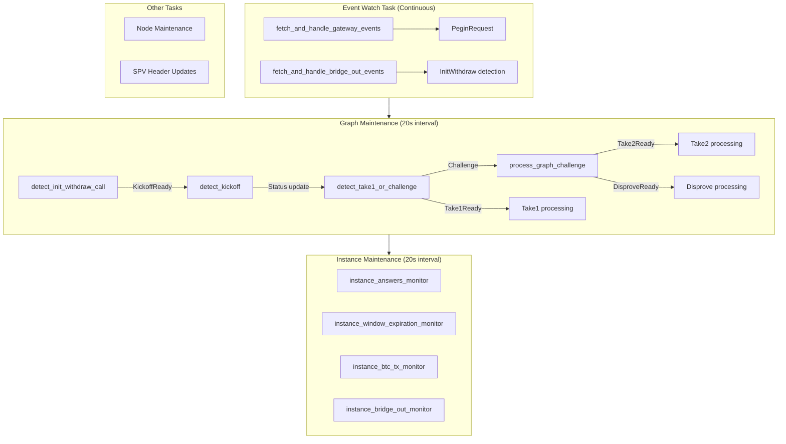

**Description**: The system runs 5 types of background tasks. Event Watch continuously monitors chain events; Graph Maintenance executes graph state machine transitions every 20 seconds; Instance Maintenance manages instance lifecycles; Node Maintenance maintains node health; SPV Maintenance updates the Bitcoin header chain.

### Task Responsibilities

| Task | Interval | Responsibility |
|------|----------|----------------|
| `run_watch_event_task` | Continuous | Monitor GOAT L2 and Bitcoin events |
| `detect_init_withdraw_call` | 20s | Detect withdrawal requests, send KickoffReady |
| `detect_kickoff` | 20s | Monitor Kickoff transaction confirmations |
| `detect_take1_or_challenge` | 20s | Check Happy Path or Challenge |
| `process_graph_challenge` | 20s | Process Challenge sub-phases |
| `instance_answers_monitor` | 20s | Track committee responses |
| `instance_window_expiration_monitor` | 20s | Handle response window timeouts |
| `spv_header_hash_update` | Periodic | Update SPV header hashes |

---

## Module Structure

```
node/src/
├── main.rs                          # Entry point, starts 4 async tasks
├── lib.rs                           # Module exports
├── action.rs                        # Message type definitions (45+ types)
├── handle.rs                        # Message dispatch and role handlers
├── p2p_msg_handler.rs              # P2P message processing interface
├── env.rs                           # Environment configuration (40+ variables)
├── utils.rs                         # Graph state management & storage utilities
├── error.rs                         # Error types
├── vk.rs                           # Verification key management
├── metrics_service.rs              # Prometheus metrics
├── rpc_service/                    # REST API implementation
│   ├── mod.rs                      # Service orchestration
│   ├── bitvm2.rs                   # BitVM2-specific endpoints
│   ├── routes.rs                   # HTTP route definitions
│   ├── validation.rs               # Input validation
│   └── handler/                    # Request handlers
├── middleware/                     # P2P network layer
│   ├── swarm.rs                    # BitvmNetworkManager, libp2p configuration
│   └── behaviour.rs                # Kademlia + Gossipsub behavior
└── scheduled_tasks/                # Background tasks
    ├── mod.rs                      # Task exports
    ├── event_watch_task.rs         # Chain event monitoring (51KB)
    ├── graph_maintenance_tasks.rs  # Graph state machine (72KB)
    ├── instance_maintenance_tasks.rs # Instance lifecycle
    ├── node_maintenance_tasks.rs   # Node health
    └── spv_maintenance_tasks.rs    # SPV updates
```

---

## Build & Run

### Prerequisites

- Rust nightly-2025-06-30+
- ZKM toolchain (optional, for proof generation)

### Build Commands

```bash
# Build for regtest
BITCOIN_NETWORK=regtest cargo build -r

# Build for testnet4
BITCOIN_NETWORK=testnet4 cargo build -r

# Build only the node binary
cargo build -r -p bitvm2-noded
```

### Generate Node Keys

```bash
# Generate P2P peer key
bitvm2-noded key peer
# Output:
# PEER_KEY=<base64-encoded-key>
# PEER_ID=<peer-id>

# Generate funding address (for Operator/Challenger)
bitvm2-noded key funding-address
# Output:
# Funding address type=p2wpkh, address=bc1q...
```

### Start Node

```bash
bitvm2-noded \
  --rpc-addr 0.0.0.0:8080 \
  --db-path ./node.db \
  --p2p-port 4001 \
  --bootnodes /ip4/x.x.x.x/tcp/4001/p2p/<peer_id>
```

### CLI Options

| Option | Description | Default |
|--------|-------------|---------|
| `--rpc-addr` | RPC service bind address | `0.0.0.0:8080` |
| `--db-path` | SQLite database path | `sqlite:/tmp/bitvm2-node.db` |
| `--p2p-port` | P2P listen port | `0` (random) |
| `--bootnodes` | Bootstrap node addresses | - |
| `--metrics-path` | Prometheus metrics endpoint | `/metrics` |
| `--enable-kademlia` | Enable Kademlia DHT | `true` |

---

## Configuration

### Environment Variables

| Variable | Required | Description | Default |
|----------|----------|-------------|---------|
| `ACTOR` | Yes | Node role: `Committee`, `Operator`, `Challenger`, `Watchtower` | `Challenger` |
| `BITCOIN_NETWORK` | Yes | Bitcoin network: `bitcoin`, `testnet4`, `signet`, `regtest` | `testnet4` |
| `GOAT_NETWORK` | Yes | GOAT network: `main`, `test` | `test` |
| `GOAT_CHAIN_URL` | Yes | GOAT L2 RPC endpoint | - |
| `GOAT_GATEWAY_CONTRACT_ADDRESS` | Yes | Gateway contract address | - |
| `BITVM_SECRET` | Yes | Node private key or seed (`seed:xxx` format) | - |
| `BITVM_BTC_ADDR_TYPE` | No | Node BTC address type: `p2wpkh` or `p2tr` | `p2wpkh` |
| `PEER_KEY` | Yes | libp2p node key (Base64 encoded) | - |
| `GOAT_PRIVATE_KEY` | Conditional | GOAT chain private key (required for Committee) | - |
| `GOAT_ADDRESS` | Conditional | GOAT address (required for Operator/Challenger) | - |
| `ENABLE_RELAYER` | No | Enable relayer mode for Committee nodes | `false` |
| `BTC_CHAIN_URL` | No | Bitcoin Esplora API endpoint | Public Esplora |
| `GOAT_PROOF_BUILD_URL` | No | Proof Builder RPC endpoint | - |
| `NODE_NAME` | No | Node display name | `ZKM` |
| `OPERATOR_NODE_SERVICE_FEE` | No | Operator service fee rate | `0.001` |

### Relayer Configuration

To run a Committee node as a graph data relayer:

```bash
export ACTOR=Committee
export ENABLE_RELAYER=true
export GOAT_PRIVATE_KEY=<private_key>
# ... other required variables
```

Relayer nodes should:
- Run 24/7 for network reliability
- Have sufficient storage for all graph data
- Be geographically distributed for redundancy

---

## RPC API

### Endpoints

| Endpoint | Method | Description |
|----------|--------|-------------|
| `/node` | GET | Get current node information |
| `/nodes` | GET | List connected nodes |
| `/nodes/overview` | GET | Node statistics overview |
| `/instances` | GET | List all instances |
| `/instance/:id` | GET | Get instance details |
| `/instances/overview` | GET | Instance statistics overview |
| `/graphs` | GET | List all graphs |
| `/graph/:id` | GET | Get graph details |
| `/graph/:id/txn` | GET | Get graph transaction list |
| `/graph/:id/tx/:txid` | GET | Get specific transaction |
| `/graph/ready_to_kickoff` | GET | Get graphs ready for kickoff |
| `/bridge_in_request` | POST | Initiate Bridge-In request |
| `/bridge_out_init` | POST | Initiate Bridge-Out request |
| `/challenge` | POST | Submit challenge |
| `/metrics` | GET | Prometheus metrics |

---

## Related Documentation

- [Architecture Document](../docs/ARCHITECTURE.md) - Full system architecture
- [Circuits README](../circuits/README.md) - ZK proof generation
- [Deployment Guide](../deployment/README.md) - Deployment instructions
- [Incentives](../docs/incentives.md) - Incentives
